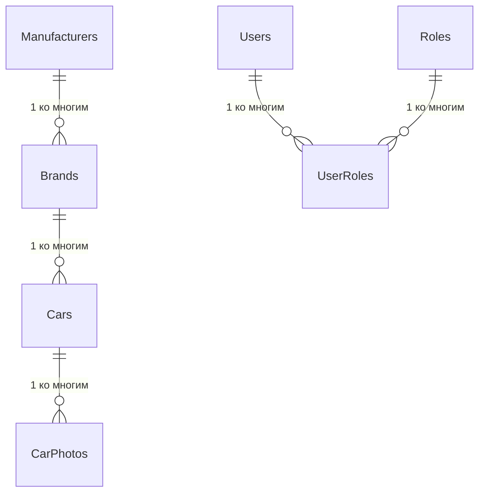

# Автосалон — проект БД, логика и документация (для Visual Studio + Entity Framework)

> Формат: **один файл `.md`**.  
> Технологический контекст: **MS SQL Server + Visual Studio + ADO.NET Entity Framework**, CRUD-интерфейс, авторизация/роли, фото, поиск/фильтрация, корректное удаление с проверкой связей.

---

## 1. Назначение системы

Информационная система «Автосалон» предназначена для ведения базы данных автосалона:

- справочник **производителей** автомобилей;
- справочник **марок/моделей** (брендов/линеек) производителей;
- учет **автомобилей** автосалона (конкретные экземпляры/позиции);
- хранение **фото** автомобилей;
- разграничение доступа по ролям (**Администратор / Менеджер / Просмотр**);
- поиск, фильтрация, отображение количества записей.

---

## 2. Роли и права доступа

### 2.1 Роли

- **Администратор**
  - Управление пользователями и ролями
  - CRUD для производителей, марок, автомобилей
- **Менеджер**
  - CRUD для автомобилей и фото
  - Просмотр справочников производителей/марок
- **Просмотр (гость)**
  - Только просмотр списков и карточек, поиск/фильтрация

### 2.2 Правила

- Неактивный пользователь (**IsActive = 0**) не может войти.
- Нельзя удалить:
  - производителя, если существуют марки этого производителя;
  - марку, если существуют автомобили этой марки.
- Удаление автомобиля допускается; фото можно удалять вместе с автомобилем каскадно либо предварительно (см. раздел 5.4).

---

## 3. Функциональные требования

### 3.1 Авторизация / регистрация

- Экран **Login**
  - ввод логина и пароля
  - успешный вход → переход в главное окно
- Экран **Registration**
  - создание нового пользователя (обычно администратор; если нужна саморегистрация — включается флагом)
- Разные роли → разный доступ к функциям UI (кнопки, вкладки, редактирование)

### 3.2 Ведение справочников

- Производители: добавление/редактирование/удаление/поиск
- Марки: добавление/редактирование/удаление/поиск

### 3.3 Ведение автомобилей

- Список автомобилей (Grid/ListBox) **с главным фото**
- Карточка автомобиля (правая панель или отдельная форма)
- CRUD:
  - Добавить (с валидацией VIN/цены/года)
  - Редактировать
  - Удалить
- Фото:
  - загрузка изображения
  - установка главного фото
  - удаление фото

### 3.4 Поиск, фильтрация, счётчики

- Поиск (строка): VIN / модель / цвет
- Фильтры:
  - производитель
  - марка
  - год (от/до)
  - цена (от/до)
  - статус (В наличии/Забронирован/Продан/Архив)
- Счетчики:
  - **общее количество записей**
  - **количество записей в режиме поиска/фильтра**
  - сообщение «Нет результатов»

---

## 4. Проект БД

### 4.1 Сущности (таблицы)

Минимальный «ядро-набор» по предметной области: **Manufacturers → Brands → Cars**.  
Для полноценной реализации требований добавлены: **CarPhotos**, **Users/Roles**.

#### 4.1.1 Manufacturers (Производители)

- `ManufacturerId` — PK
- `Name` — уникально
- `Country` — страна
- `Website` — сайт (опционально)
- `Phone` — телефон (опционально)
- `CreatedAt` — дата добавления

#### 4.1.2 Brands (Марки/линейки)

- `BrandId` — PK
- `ManufacturerId` — FK → Manufacturers
- `Name` — название марки/линейки (уникально в рамках производителя)
- `Segment` — сегмент/класс (опционально)
- `CreatedAt`

#### 4.1.3 Cars (Автомобили)

Автомобиль хранится как конкретная позиция автосалона (экземпляр/товар).

- `CarId` — PK
- `BrandId` — FK → Brands
- `VIN` — уникально, длина 17
- `ModelName` — модель/комплектация (например, “Camry 2.5 AT”)
- `ModelYear` — год выпуска
- `Color` — цвет
- `MileageKm` — пробег (км)
- `Price` — цена
- `BodyType` — кузов (седан/хэтчбек/кроссовер…)
- `Engine` — двигатель (например, “2.5 бензин”)
- `Transmission` — коробка (AT/MT/CVT)
- `DriveType` — привод (FWD/RWD/AWD)
- `Status` — статус (0..3)
- `CreatedAt`

#### 4.1.4 CarPhotos (Фото автомобилей)

- `CarPhotoId` — PK
- `CarId` — FK → Cars
- `FileName` — имя файла (опционально)
- `ContentType` — image/jpeg, image/png (опционально)
- `Photo` — `VARBINARY(MAX)` (само изображение)
- `IsMain` — главное фото (0/1)
- `CreatedAt`

> Почему `VARBINARY(MAX)`: удобно выполнить требование «обязательно с фото» без файлового сервера и путей. При желании можно хранить путь к файлу, но тогда нужна отдельная политика хранения.

#### 4.1.5 Users / Roles (Авторизация и роли)

- `Users`:
  - `UserId` — PK
  - `Login` — уникально
  - `PasswordHash` — байты
  - `PasswordSalt` — байты
  - `DisplayName`
  - `IsActive`
  - `CreatedAt`

- `Roles`:
  - `RoleId` — PK
  - `Name` — уникально (Admin/Manager/Viewer)

- `UserRoles`:
  - `(UserId, RoleId)` — составной PK (или отдельный Id)
  - FK → Users, FK → Roles

---

### 4.2 Связи и кардинальности



---

### 4.3 Справочник статусов автомобиля

Предлагаемый enum (хранится в `Cars.Status`):

- `0` — В наличии
- `1` — Забронирован
- `2` — Продан
- `3` — Архив

---

### 4.4 Индексы и ограничения

**Обязательные ограничения:**
- VIN уникален: `UNIQUE (VIN)`
- Производитель уникален по имени: `UNIQUE (Name)`
- Марка уникальна в рамках производителя: `UNIQUE (ManufacturerId, Name)`
- CHECK:
  - `LEN(VIN)=17`
  - `Price >= 0`
  - `MileageKm >= 0`
  - `ModelYear` в разумном диапазоне (пример ниже)

**Индексы (для ускорения поиска/фильтра):**
- `Cars(BrandId)`
- `Cars(Status)`
- `Cars(ModelYear)`
- `Cars(Price)`
- `Brands(ManufacturerId)`

---

## 5. SQL Server: скрипт создания БД

> Скрипт можно выполнить в Microsoft SQL Server Management Studio.

```sql
-- 1) База данных
IF DB_ID(N'AutoSalon') IS NULL
BEGIN
    CREATE DATABASE AutoSalon;
END
GO

USE AutoSalon;
GO

-- 2) Таблица Manufacturers
IF OBJECT_ID(N'dbo.Manufacturers', N'U') IS NULL
BEGIN
    CREATE TABLE dbo.Manufacturers
    (
        ManufacturerId INT IDENTITY(1,1) NOT NULL CONSTRAINT PK_Manufacturers PRIMARY KEY,
        Name           NVARCHAR(100) NOT NULL,
        Country        NVARCHAR(60)  NULL,
        Website        NVARCHAR(200) NULL,
        Phone          NVARCHAR(30)  NULL,
        CreatedAt      DATETIME2(0)  NOT NULL CONSTRAINT DF_Manufacturers_CreatedAt DEFAULT (SYSDATETIME())
    );

    CREATE UNIQUE INDEX UX_Manufacturers_Name ON dbo.Manufacturers(Name);
END
GO

-- 3) Таблица Brands
IF OBJECT_ID(N'dbo.Brands', N'U') IS NULL
BEGIN
    CREATE TABLE dbo.Brands
    (
        BrandId        INT IDENTITY(1,1) NOT NULL CONSTRAINT PK_Brands PRIMARY KEY,
        ManufacturerId INT NOT NULL,
        Name           NVARCHAR(100) NOT NULL,
        Segment        NVARCHAR(50)  NULL,
        CreatedAt      DATETIME2(0)  NOT NULL CONSTRAINT DF_Brands_CreatedAt DEFAULT (SYSDATETIME()),

        CONSTRAINT FK_Brands_Manufacturers
            FOREIGN KEY (ManufacturerId) REFERENCES dbo.Manufacturers(ManufacturerId)
            ON DELETE NO ACTION
            ON UPDATE NO ACTION
    );

    CREATE UNIQUE INDEX UX_Brands_ManufacturerId_Name ON dbo.Brands(ManufacturerId, Name);
    CREATE INDEX IX_Brands_ManufacturerId ON dbo.Brands(ManufacturerId);
END
GO

-- 4) Таблица Cars
IF OBJECT_ID(N'dbo.Cars', N'U') IS NULL
BEGIN
    CREATE TABLE dbo.Cars
    (
        CarId         INT IDENTITY(1,1) NOT NULL CONSTRAINT PK_Cars PRIMARY KEY,
        BrandId       INT NOT NULL,
        VIN           NVARCHAR(17) NOT NULL,
        ModelName     NVARCHAR(120) NOT NULL,
        ModelYear     INT NOT NULL,
        Color         NVARCHAR(50)  NULL,
        MileageKm     INT NOT NULL CONSTRAINT DF_Cars_MileageKm DEFAULT(0),
        Price         DECIMAL(18,2) NOT NULL,
        BodyType      NVARCHAR(40)  NULL,
        Engine        NVARCHAR(60)  NULL,
        Transmission  NVARCHAR(20)  NULL,
        DriveType     NVARCHAR(20)  NULL,
        Status        TINYINT NOT NULL CONSTRAINT DF_Cars_Status DEFAULT(0),
        CreatedAt     DATETIME2(0) NOT NULL CONSTRAINT DF_Cars_CreatedAt DEFAULT (SYSDATETIME()),

        CONSTRAINT FK_Cars_Brands
            FOREIGN KEY (BrandId) REFERENCES dbo.Brands(BrandId)
            ON DELETE NO ACTION
            ON UPDATE NO ACTION,

        CONSTRAINT CK_Cars_VIN_Len CHECK (LEN(VIN) = 17),
        CONSTRAINT CK_Cars_Price_Positive CHECK (Price >= 0),
        CONSTRAINT CK_Cars_Mileage_Positive CHECK (MileageKm >= 0),
        CONSTRAINT CK_Cars_ModelYear_Range CHECK (ModelYear BETWEEN 1950 AND YEAR(GETDATE()) + 1),
        CONSTRAINT CK_Cars_Status_Range CHECK (Status BETWEEN 0 AND 3)
    );

    CREATE UNIQUE INDEX UX_Cars_VIN ON dbo.Cars(VIN);

    CREATE INDEX IX_Cars_BrandId ON dbo.Cars(BrandId);
    CREATE INDEX IX_Cars_Status ON dbo.Cars(Status);
    CREATE INDEX IX_Cars_ModelYear ON dbo.Cars(ModelYear);
    CREATE INDEX IX_Cars_Price ON dbo.Cars(Price);
END
GO

-- 5) Таблица CarPhotos
IF OBJECT_ID(N'dbo.CarPhotos', N'U') IS NULL
BEGIN
    CREATE TABLE dbo.CarPhotos
    (
        CarPhotoId   INT IDENTITY(1,1) NOT NULL CONSTRAINT PK_CarPhotos PRIMARY KEY,
        CarId        INT NOT NULL,
        FileName     NVARCHAR(255) NULL,
        ContentType  NVARCHAR(100) NULL,
        Photo        VARBINARY(MAX) NOT NULL,
        IsMain       BIT NOT NULL CONSTRAINT DF_CarPhotos_IsMain DEFAULT(0),
        CreatedAt    DATETIME2(0) NOT NULL CONSTRAINT DF_CarPhotos_CreatedAt DEFAULT (SYSDATETIME()),

        CONSTRAINT FK_CarPhotos_Cars
            FOREIGN KEY (CarId) REFERENCES dbo.Cars(CarId)
            ON DELETE CASCADE
            ON UPDATE NO ACTION
    );

    CREATE INDEX IX_CarPhotos_CarId ON dbo.CarPhotos(CarId);
    CREATE INDEX IX_CarPhotos_CarId_IsMain ON dbo.CarPhotos(CarId, IsMain);
END
GO

-- 6) Таблицы Users / Roles / UserRoles
IF OBJECT_ID(N'dbo.Users', N'U') IS NULL
BEGIN
    CREATE TABLE dbo.Users
    (
        UserId       INT IDENTITY(1,1) NOT NULL CONSTRAINT PK_Users PRIMARY KEY,
        Login        NVARCHAR(50) NOT NULL,
        PasswordHash VARBINARY(64) NOT NULL,
        PasswordSalt VARBINARY(16) NOT NULL,
        DisplayName  NVARCHAR(100) NULL,
        IsActive     BIT NOT NULL CONSTRAINT DF_Users_IsActive DEFAULT(1),
        CreatedAt    DATETIME2(0) NOT NULL CONSTRAINT DF_Users_CreatedAt DEFAULT (SYSDATETIME())
    );

    CREATE UNIQUE INDEX UX_Users_Login ON dbo.Users(Login);
END
GO

IF OBJECT_ID(N'dbo.Roles', N'U') IS NULL
BEGIN
    CREATE TABLE dbo.Roles
    (
        RoleId  INT IDENTITY(1,1) NOT NULL CONSTRAINT PK_Roles PRIMARY KEY,
        Name    NVARCHAR(30) NOT NULL
    );

    CREATE UNIQUE INDEX UX_Roles_Name ON dbo.Roles(Name);
END
GO

IF OBJECT_ID(N'dbo.UserRoles', N'U') IS NULL
BEGIN
    CREATE TABLE dbo.UserRoles
    (
        UserId INT NOT NULL,
        RoleId INT NOT NULL,

        CONSTRAINT PK_UserRoles PRIMARY KEY (UserId, RoleId),

        CONSTRAINT FK_UserRoles_Users
            FOREIGN KEY (UserId) REFERENCES dbo.Users(UserId)
            ON DELETE CASCADE
            ON UPDATE NO ACTION,

        CONSTRAINT FK_UserRoles_Roles
            FOREIGN KEY (RoleId) REFERENCES dbo.Roles(RoleId)
            ON DELETE CASCADE
            ON UPDATE NO ACTION
    );
END
GO

-- 7) Начальные роли (seed)
IF NOT EXISTS (SELECT 1 FROM dbo.Roles WHERE Name = N'Admin')
    INSERT INTO dbo.Roles(Name) VALUES (N'Admin');
IF NOT EXISTS (SELECT 1 FROM dbo.Roles WHERE Name = N'Manager')
    INSERT INTO dbo.Roles(Name) VALUES (N'Manager');
IF NOT EXISTS (SELECT 1 FROM dbo.Roles WHERE Name = N'Viewer')
    INSERT INTO dbo.Roles(Name) VALUES (N'Viewer');
GO
```

---

## 6. Логика приложения (алгоритмы и правила)

### 6.1 Алгоритм входа (Login)

1. Пользователь вводит `Login` и `Password`.
2. Система ищет запись в `Users` по `Login`.
3. Если `IsActive = 0` → отказ.
4. Система вычисляет хэш пароля (по `PasswordSalt`) и сравнивает с `PasswordHash`.
5. При успехе загружает роли пользователя из `UserRoles` → `Roles`.
6. Открывает главное окно и включает/выключает элементы интерфейса по ролям.

**Рекомендация по хранению пароля:**
- хранить **salt + hash** (например, PBKDF2/BCrypt/Argon2; для учебного — PBKDF2 достаточно)
- не хранить пароль в открытом виде.

### 6.2 CRUD производителей

- **Добавить/редактировать**: проверка уникальности `Name`.
- **Удалить**:
  - до удаления выполнить проверку: есть ли связанные `Brands`.
  - если есть → показать понятное сообщение пользователю.
  - если нет → удалить.

Пример SQL-проверки:

```sql
DECLARE @ManufacturerId INT = 1;

IF EXISTS (SELECT 1 FROM dbo.Brands WHERE ManufacturerId = @ManufacturerId)
    SELECT N'Нельзя удалить производителя: существуют марки.' AS Message;
ELSE
    DELETE dbo.Manufacturers WHERE ManufacturerId = @ManufacturerId;
```

### 6.3 CRUD марок

- Аналогично производителям.
- Удаление запрещено, если есть связанные `Cars`.

### 6.4 CRUD автомобилей и фото

**Добавление автомобиля:**
- VIN обязателен и длиной 17
- VIN уникален
- Цена ≥ 0
- Год в диапазоне

**Фото:**
- При добавлении фото:
  - изображение читается в `byte[]` и сохраняется в `CarPhotos.Photo`
- Для главного фото:
  - перед установкой `IsMain=1` сбросить остальные фото этого авто `IsMain=0`

Пример SQL:

```sql
DECLARE @CarId INT = 10;
DECLARE @CarPhotoId INT = 50;

UPDATE dbo.CarPhotos SET IsMain = 0 WHERE CarId = @CarId;
UPDATE dbo.CarPhotos SET IsMain = 1 WHERE CarPhotoId = @CarPhotoId AND CarId = @CarId;
```

**Удаление автомобиля:**
- Рекомендуется оставить каскад на фото (`ON DELETE CASCADE`), чтобы при удалении авто связанные фото удалялись автоматически.

---

## 7. Запросы для списков, поиска и фильтров

### 7.1 Базовый список автомобилей (с брендом и производителем)

```sql
SELECT
    c.CarId,
    c.VIN,
    c.ModelName,
    c.ModelYear,
    c.Color,
    c.Price,
    c.Status,
    b.Name AS BrandName,
    m.Name AS ManufacturerName
FROM dbo.Cars c
JOIN dbo.Brands b ON b.BrandId = c.BrandId
JOIN dbo.Manufacturers m ON m.ManufacturerId = b.ManufacturerId
ORDER BY c.CreatedAt DESC;
```

### 7.2 Поиск по VIN/модели/цвету

```sql
DECLARE @q NVARCHAR(100) = N'camry';

SELECT TOP (200)
    c.*
FROM dbo.Cars c
WHERE c.VIN LIKE N'%' + @q + N'%'
   OR c.ModelName LIKE N'%' + @q + N'%'
   OR c.Color LIKE N'%' + @q + N'%'
ORDER BY c.CreatedAt DESC;
```

### 7.3 Фильтры (пример)

Фильтр по производителю + диапазону цен:

```sql
DECLARE @ManufacturerId INT = 1;
DECLARE @MinPrice DECIMAL(18,2) = 1000000;
DECLARE @MaxPrice DECIMAL(18,2) = 3000000;

SELECT c.*
FROM dbo.Cars c
JOIN dbo.Brands b ON b.BrandId = c.BrandId
WHERE b.ManufacturerId = @ManufacturerId
  AND c.Price BETWEEN @MinPrice AND @MaxPrice
ORDER BY c.Price;
```

---

## 8. Рекомендации по Entity Framework

Подход 1 (проще для практики): **Database First**  
1) Создать БД в SSMS скриптом  
2) В Visual Studio добавить модель EF:
- EF6: *ADO.NET Entity Data Model → EF Designer from database*
- EF Core: *Scaffold-DbContext* (пакеты Microsoft.EntityFrameworkCore.SqlServer)

Подход 2: **Code First**  
- Описать сущности и контекст, затем миграции.

### 8.1 Навигационные свойства (ожидаемо)

- `Manufacturer.Brands`
- `Brand.Manufacturer`, `Brand.Cars`
- `Car.Brand`, `Car.CarPhotos`
- `CarPhoto.Car`
- `User.UserRoles`, `Role.UserRoles`

---

## 9. Пользовательская документация (проект руководства пользователя)

### 9.1 Условия эксплуатации

- ОС: Windows 10/11
- MS SQL Server (Express подходит)
- .NET (в зависимости от типа проекта: .NET Framework / .NET 6+)
- Разрешение экрана: от 1366×768

### 9.2 Подготовка к работе

1. Установить MS SQL Server и SSMS.
2. Выполнить скрипт создания БД (раздел 5).
3. Настроить строку подключения в приложении.
4. Запустить приложение.

### 9.3 Порядок работы

#### Вход в систему
1. Открыть приложение.
2. Ввести логин/пароль.
3. Нажать «Войти».

#### Работа со справочником производителей
1. Открыть вкладку «Производители».
2. Нажать «Добавить».
3. Заполнить поля.
4. Нажать «Сохранить».

#### Работа со справочником марок
1. Открыть вкладку «Марки».
2. Выбрать производителя.
3. Добавить/редактировать марку.

#### Работа с автомобилями
1. Открыть вкладку «Автомобили».
2. Для добавления:
   - нажать «Добавить»
   - указать VIN, модель, год, цену и т.д.
3. Для фото:
   - открыть карточку автомобиля
   - нажать «Добавить фото»
   - выбрать изображение
   - (опционально) «Сделать главным»
4. Поиск:
   - ввести строку в поле поиска
   - при необходимости применить фильтры

### 9.4 Сообщения пользователю и ошибки

- «Неверный логин или пароль»
- «Пользователь заблокирован»
- «Нельзя удалить производителя: существуют марки»
- «Нельзя удалить марку: существуют автомобили»
- «VIN должен содержать 17 символов»
- «VIN уже существует»

---

## 10. План тестирования (пример набора тестов)

| № | Сценарий | Данные | Ожидаемый результат |
|---:|---|---|---|
| 1 | Вход с верным паролем | login=admin, pass=correct | Успешный вход, открывается главное окно |
| 2 | Вход с неверным паролем | login=admin, pass=wrong | Сообщение об ошибке, вход запрещён |
| 3 | Добавить производителя | Name="Toyota" | Запись создана |
| 4 | Дублировать производителя | Name="Toyota" повторно | Ошибка уникальности, запись не создаётся |
| 5 | Удалить производителя со связями | Toyota, у него есть марки | Запрет удаления, понятное сообщение |
| 6 | Добавить авто с VIN 17 | VIN=17 символов | Запись создана |
| 7 | Добавить авто с VIN 16 | VIN=16 символов | Ошибка валидации |
| 8 | Загрузка фото | jpg/png | Фото сохраняется, отображается в списке/карточке |
| 9 | Поиск по VIN | ввод части VIN | В списке только подходящие записи |
| 10 | Фильтр по цене | 1–3 млн | Выводятся записи в диапазоне, счётчики обновляются |

---

## 11. Что включить в отчёт (чек-лист)

- [ ] Описание предметной области (автосалон)
- [ ] Структура БД (таблицы, связи, ключи)
- [ ] Скрипт создания БД
- [ ] Скриншоты интерфейса (Login, списки, формы CRUD, фото)
- [ ] Фрагменты кода (EF, CRUD, поиск/фильтр, фото)
- [ ] Таблица тестов и результаты
- [ ] Перечень ошибок/отладки
- [ ] Примеры рефакторинга (до/после)

---

## 12. Минимальный план UI (чтобы быстрее закрыть практику)

1. **LoginForm** (логин/пароль)
2. **MainForm** (TabControl):
   - Tab1: Производители (Grid + CRUD)
   - Tab2: Марки (Grid + ComboBox производитель + CRUD)
   - Tab3: Автомобили (Grid/List + фильтры + карточка справа + фото)

---

Если хочешь, я могу:
- адаптировать поля таблицы `Cars` под твой стиль (минимум/максимум),
- подготовить **LINQ-запросы** под EF,
- сделать «рыбу» (шаблон) отчёта в Markdown (структура, куда вставлять скриншоты и код).
